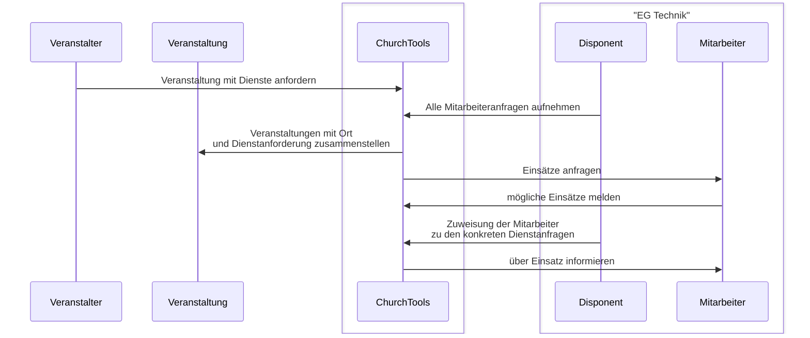
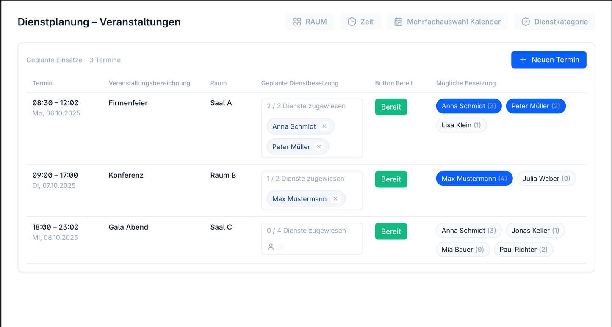

# VeranstaltungsOrtbezogene Dienstplanung in ChurchTools

## Aufgabenstellung

Wir haben Veranstaltungen in verschiedenen Räumen. Jede Veranstaltung hat Dienstanforderungen.
Die Mitarbeiter haben Schwerpunkte nach Fähigkeiten und Veranstaltungsraum. Sie müssen **ihre möglichen Einsatzzeiten melden**.
Ein Disponent muss die Mitarbeiter aufgrund aller Veranstaltungen den konkreten Dienstanforderungen zuweisen,
dabei sollte auch eine ausgewogene Auslastung der Mitarbeiter berücksichtigt werden.

### Edge case

* die Veranstaltung wird in einen anderen Raum verlegt und muss daher erneut geplant werden.

## Drei Prozesse

* Quartalstreffen
* Disponent
* Individuelle Zusage (läuft jetzt )

## Prozessübersicht - mit Disponent

- zentrale Gruppe pro DienstKategorie für Mitarbeiter zur Besetzugng von Diensten mit Schwerpunktkategorien: Funktion, Veranstaltungsraum, Zeitpunkt
- Verschiedene Veranstaltungsräume
- Veranstalter die eine Veranstaltung in einem Raum planen und Dienste anforern
- Mitarbeiter führen Dienste aus
- Mitarbeiter melden aufgrund der gesamten veranstaltungsliste (über alle Veranstaltungsräume) mögliche Einsätze

  - Bereit -> grün, nicht bereit -> rot, zugeteit ist 'blau' Würde erlauben, den Quartalstreffen und Disponent gleich zu behandeln. Abwesend -> rot (auch kennzeichnen ggf. durch Icon)
    - Besetzungen: icons für externe (Leute ausserhalb CT da gibt es schon ein icon ) oder ausserhalb Diesntbesetzergruppe 

- Disponent pro Veranstaltungskategorie ordnet die Mitarbeiter den konkreten Dienstanfragen zu. 
  Dabei berücksichtigt er diie Meldungen der Mitarbeitzer zum möglichen Einsatz

  

* reihenfolgen Termin, Raum, titel
* die Maske arbeitet auf Ebene eines Dienstes - hat auch eine Auswahl der Dienste innerhalb der ausgewählten Dienstkategorie
* beim hover über eine Person, ein Tooltip mit z.b. Schwerpunkten aus den Dienstbesetzergruppen
* 

## Umsetzung in ChurchTools

### 1. Grundkonfiguration

#### 1.1 Bestehende Kalender nutzen
- Verwendung der vorhandenen Kalender entsprechend dem Gemeindebezug und der Veröffentlichung
- Die Raumbuchung erfolgt über die Ressourcenanforderung im jeweiligen Kalendertermin
- Dienstanforderungen werden direkt dem zugeordneten Termin entnommen
- Konsistente Nutzung der Kalender und Dienstkategorien im gesamten Team sicherstellen

#### 1.2 Dienstbesetzergruppen einrichten
- Dienstbesetzergruppen für verschiedene Tätigkeitsbereiche und GS/GZ `EG GZ Ton` `EG GS Präsentation`
  - Disponieren könnten die Leiter der beteilidgten Dienstbesetzergruppen

- Berechtigungen für die Dienstbesetzergruppen konfigurieren -> BW

### 2. Veranstaltungen anlegen

#### 2.1 Veranstaltung erstellen
- Neue Veranstaltung im entsprechenden Gemeindekalender anlegen
- Veranstaltungstyp und -kategorie auswählen
- Zeit und Dauer der Veranstaltung festlegen
- Ressourcenanforderung für den Veranstaltungsraum stellen
  - Raum entsprechend der Veranstaltungsanforderungen buchen
  - Weitere benötigte Ressourcen zuweisen (z.B. Technik, Ausstattung)
  - Konflikte bei der Ressourcenbelegung prüfen

#### 2.2 Verfügbare Dienste definieren
- Erl.
  

