# Planungsszenarien mit Berechtigungen

## Überblick

Die Extension unterstützt mehrere Planungsszenarien (z.B. "Service", "Technik-GZ", "Deko"), wobei jedes Szenario eigene Daten und Berechtigungen hat.

## Konzept

### Planungsszenario

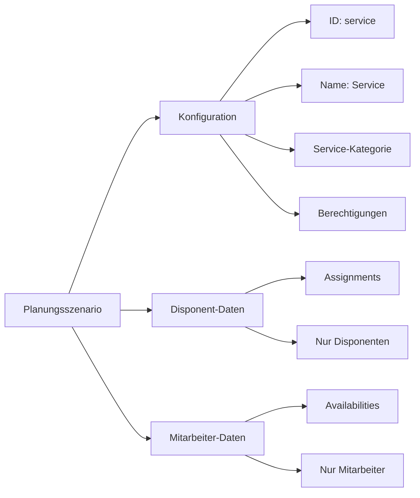

Ein Planungsszenario repräsentiert einen Planungskontext mit:
- **ID:** Eindeutiger Identifier (z.B. "service", "technik-gz", "deko")
- **Name:** Anzeigename (z.B. "Service", "Technik-GZ", "Deko")
- **Beschreibung:** Erklärung des Szenarios
- **Service-Kategorie:** Verknüpfung zu ChurchTools Dienstkategorie
- **Berechtigungen:** Separate Listen für Disponent- und Mitarbeiter-Zugriff

### Datentypen pro Szenario

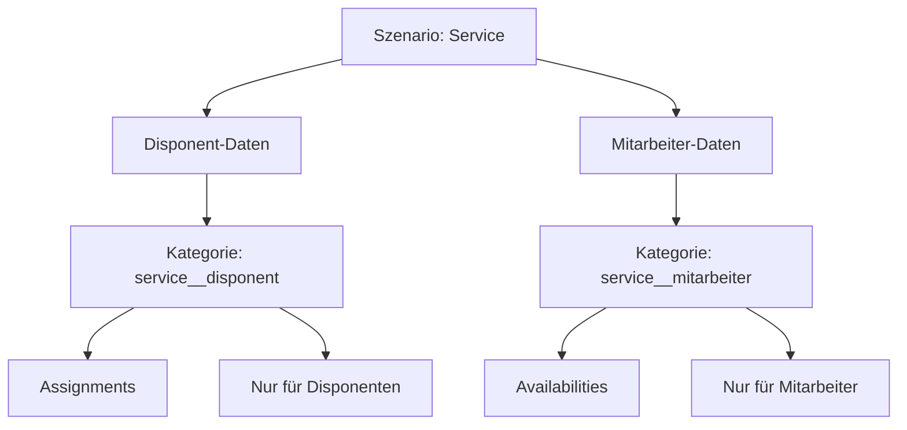

Jedes Szenario hat zwei Datentypen:

1. **Disponent-Daten:** Planungsdaten (Assignments, etc.)
   - Nur für Disponenten sichtbar/editierbar
   - Kategorie: `{scenario-id}__disponent`

2. **Mitarbeiter-Daten:** Verfügbarkeiten, Präferenzen
   - Für Mitarbeiter sichtbar/editierbar
   - Kategorie: `{scenario-id}__mitarbeiter`

## Custom Data Kategorien

### Struktur-Übersicht

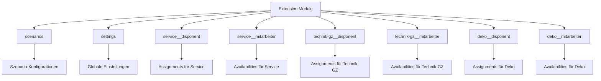

### Naming Convention

```
{scenario-id}__{data-type}
```

**Doppel-Unterstrich `__` als Trennzeichen** für klare Trennung zwischen Szenario-ID und Datentyp.

**Beispiele:**
- `service__disponent` - Disponent-Daten für Service
- `service__mitarbeiter` - Mitarbeiter-Daten für Service
- `technik-gz__disponent` - Disponent-Daten für Technik-GZ
- `technik-gz__mitarbeiter` - Mitarbeiter-Daten für Technik-GZ
- `deko__disponent` - Disponent-Daten für Deko
- `deko__mitarbeiter` - Mitarbeiter-Daten für Deko

**Parsing:**
```javascript
const [scenarioId, dataType] = categoryName.split('__');
// "technik-gz__mitarbeiter" → ["technik-gz", "mitarbeiter"]
```

## Datenmodell

### Szenario-Konfiguration

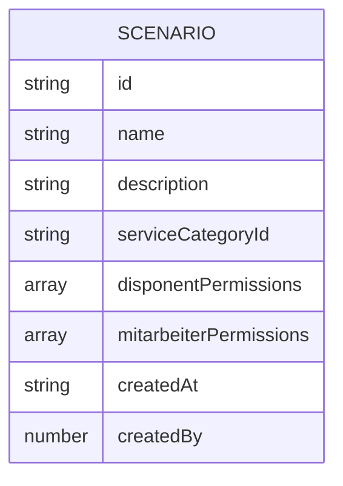

Gespeichert in Kategorie `scenarios`:
- ID des Szenarios
- Anzeigename
- Beschreibung
- ChurchTools Service Category ID
- Liste der User-IDs mit Disponent-Berechtigung
- Liste der User-IDs mit Mitarbeiter-Berechtigung
- Erstellungszeitpunkt und Ersteller

### Disponent-Daten (Assignments)

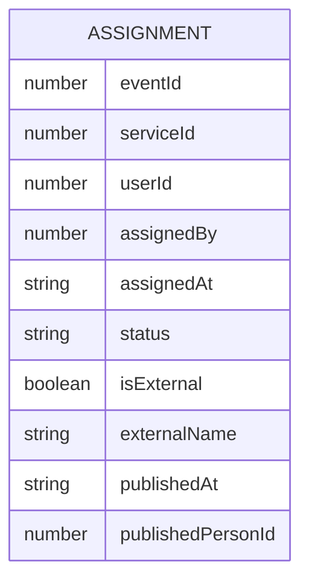

Gespeichert in Kategorie `{scenario-id}__disponent`:
- Event-ID und Service-ID
- Zugewiesene Person (User-ID oder null)
- Wer hat zugewiesen und wann
- Status (assigned, confirmed, declined)
- Externe Person (Flag und Name)
- Publish-Informationen (Zeitpunkt und was published wurde)

### Mitarbeiter-Daten (Availabilities)

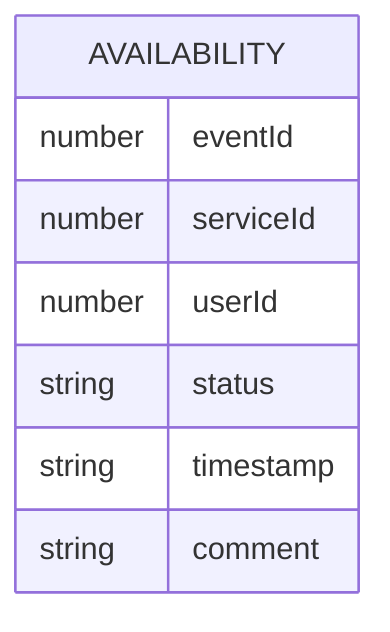

Gespeichert in Kategorie `{scenario-id}__mitarbeiter`:
- Event-ID und Service-ID
- User-ID
- Verfügbarkeits-Status (yes, maybe, no, absent)
- Zeitstempel
- Optional: Kommentar

## Workflow

### Berechtigungsprüfung

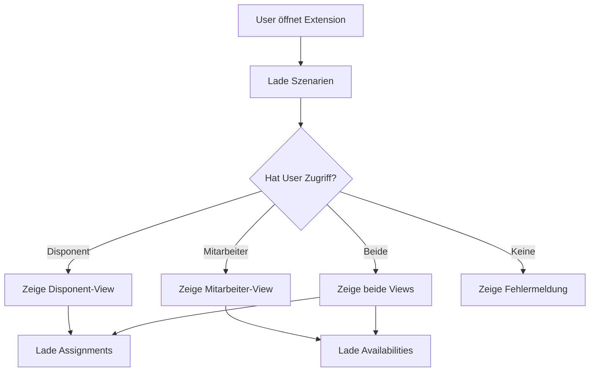

### Daten-Zugriff

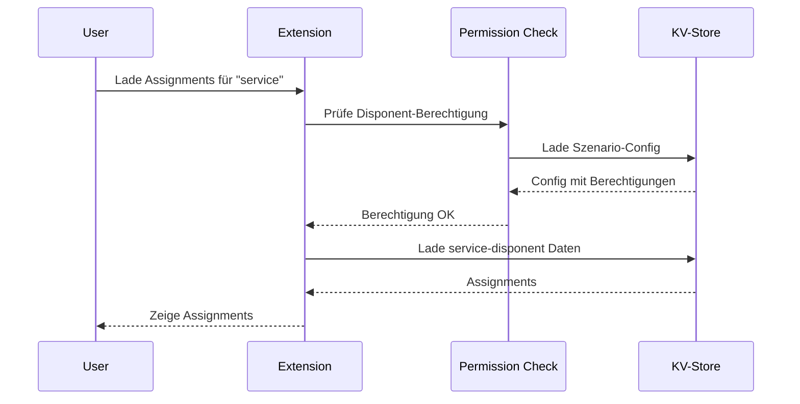

### Setup-Prozess

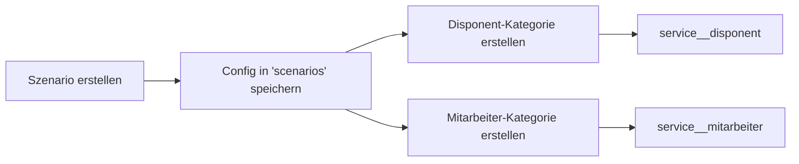

## Berechtigungs-Optionen

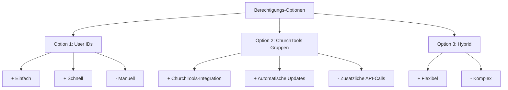

### Option 1: User IDs

Speichere User-IDs direkt in der Szenario-Konfiguration.

**Vorteile:**
- Einfach zu implementieren
- Schnelle Prüfung

**Nachteile:**
- Manuelles Hinzufügen/Entfernen von Usern
- Keine Gruppen-Unterstützung

### Option 2: ChurchTools Gruppen

Nutze ChurchTools-Gruppen für Berechtigungen (z.B. "Service-Disponent", "Service-Mitarbeiter").

**Vorteile:**
- Nutzt ChurchTools-Berechtigungssystem
- Gruppen-Verwaltung in ChurchTools
- Automatische Updates bei Gruppen-Änderungen

**Nachteile:**
- Zusätzliche API-Calls
- Abhängigkeit von ChurchTools-Gruppen

### Option 3: Hybrid

Kombiniere User-IDs und Gruppen-IDs für maximale Flexibilität.

## Best Practices

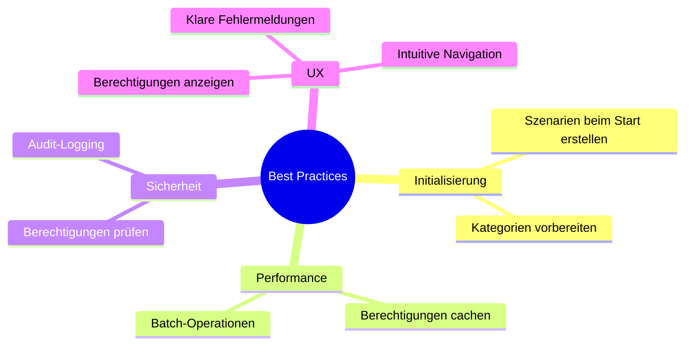

1. **Initialisierung:** Erstelle alle Szenarien beim ersten Start
2. **Caching:** Cache Berechtigungen für Performance
3. **Fehlerbehandlung:** Zeige benutzerfreundliche Fehlermeldungen bei fehlenden Berechtigungen
4. **Audit:** Logge alle Berechtigungs-Prüfungen
5. **UI-Feedback:** Zeige deutlich, welche Berechtigungen der User hat

## Migration

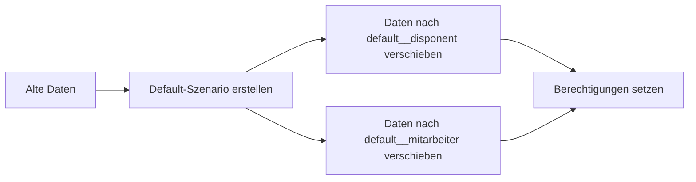

Wenn bereits Daten ohne Szenarien existieren:
1. Erstelle ein "default" Szenario
2. Verschiebe bestehende Assignments nach `default__disponent`
3. Verschiebe bestehende Availabilities nach `default__mitarbeiter`
4. Setze passende Berechtigungen

## Siehe auch

- [Key-Value Store Guide](key-value-store.md) - Grundlagen des KV-Stores
- [Assignment Strategy](assignment-strategy.md) - Dienstplanungs-Strategie
